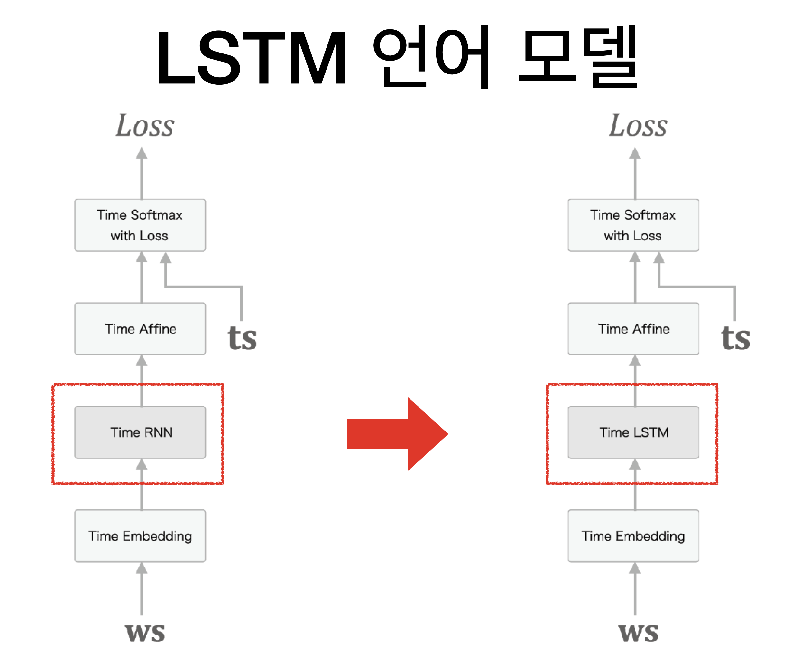

## Chapter 6 게이트가 추가된 RNN

### Gradient of RNN
* [visualize_gradient.ipynb](visualize_gradient.ipynb)

### LSTM

* [rnnlm.py](rnnlm.py)
* [train_rnnlm.py](train_rnnlm.py)

### LSTM with dropout and output embedding
* [better_rnnlm.py](better_rnnlm.py)
* [train_better_rnnlm.py](train_better_rnnlm.py)
